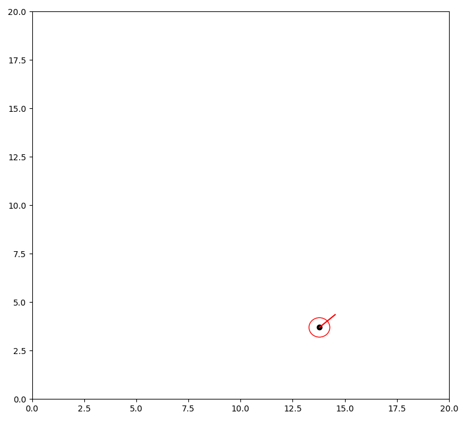
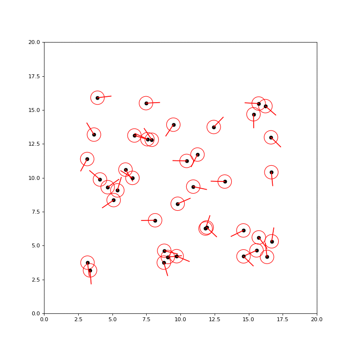
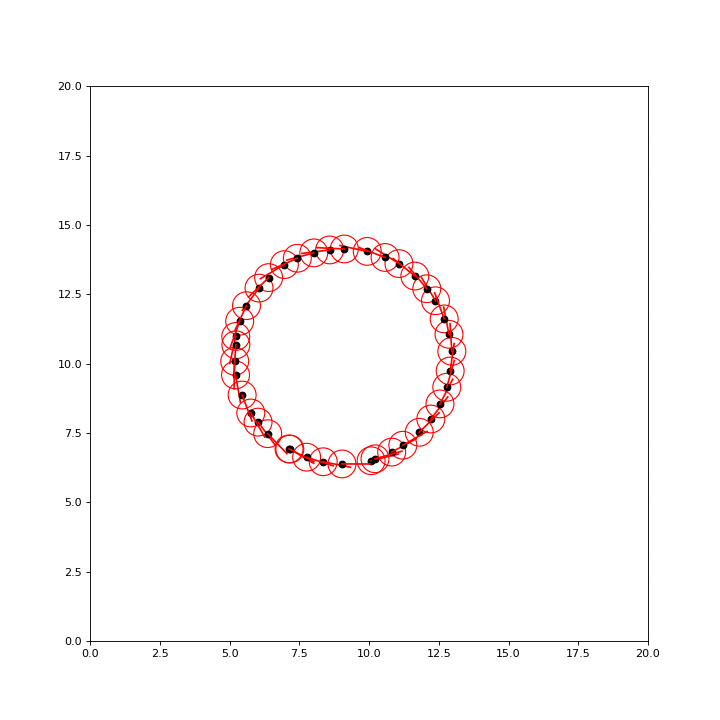

# Swarm on Python3의 사본

## Environment

- Dependency: Python3, Matplotlib, imagemagick (for gif capture)
- [https://github.com/Road-Balance/robot-swarm-simulation](https://github.com/Road-Balance/robot-swarm-simulation)

## Behavioral Structure

### Robot Modeling

- Based on the Differential Drive driving model.
- Red straight line is the direction the robot is currently pointing at
- Detection angle is 45 degrees forward and left, with a total angle of 90 degrees
- Detection length, angle can be tuned to variables.
- Rotate in place if no robot is detected.
- Start position, angle is random.

### Search

Two-dimensional loop

- Each robot calculates its distance, angle (between angles) from all other robots based on itself (Lidar modeling)
- Record all distance and side angle information of robots within detection length & angle
- Calculate the mean of length and angle
- if (average angle > Trigger) → Rotate in that direction
- if (average distance < proximity distance) → Speed reduction

Control Variable 

- Linear Speed
- Angular Speed
- Detection FOV
- Detection Range
- Trigger Angle
- Trigger Range

### Execution Results

- Robots that cannot cluster  vibrate in the center.
- Robots in the cluster move and circle.

- If the Trigger Angle value is small, rotation occurs frequently and clusters are formed separately.
- Then Stop

- If the Trigger Angle is large and the angular velocity is slow, the swarm is large and diverges

### Solution

- Workaround: Swap to trigger only in the same direction as the swivel direction (default spin direction) of the cluster.
- Ensure swarms are formed accurately.
- Minor Code Cleanup

